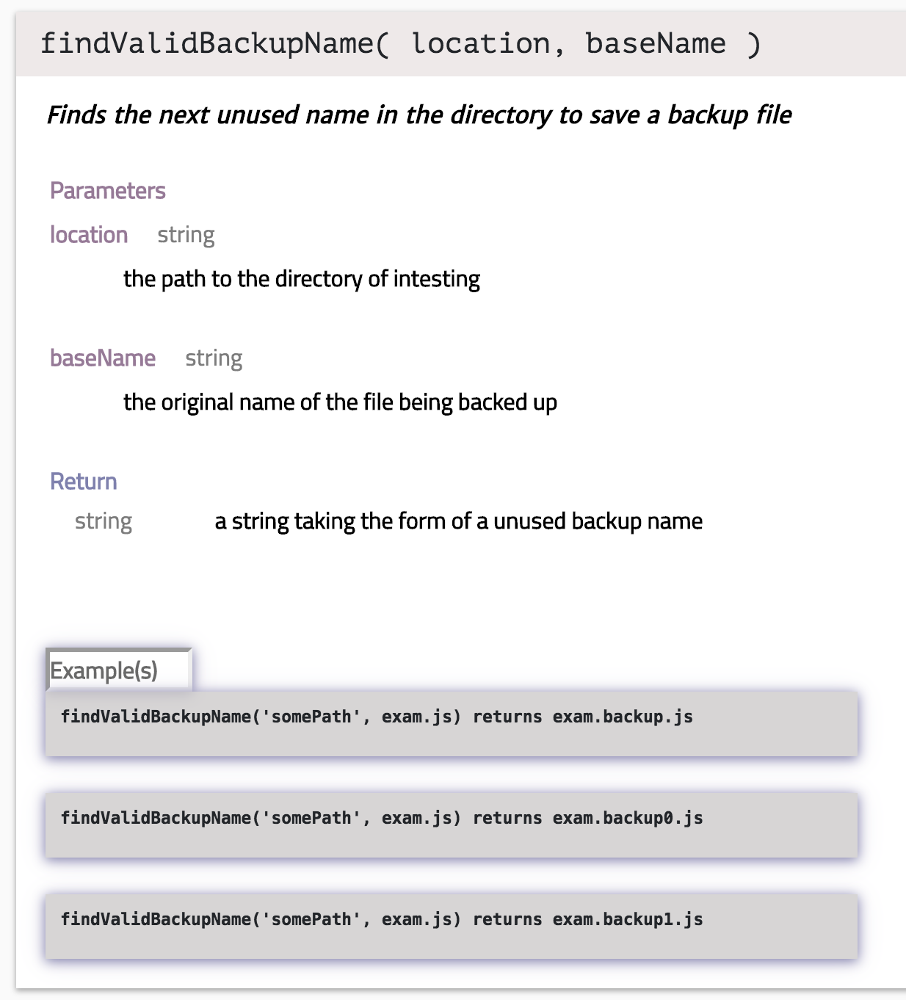
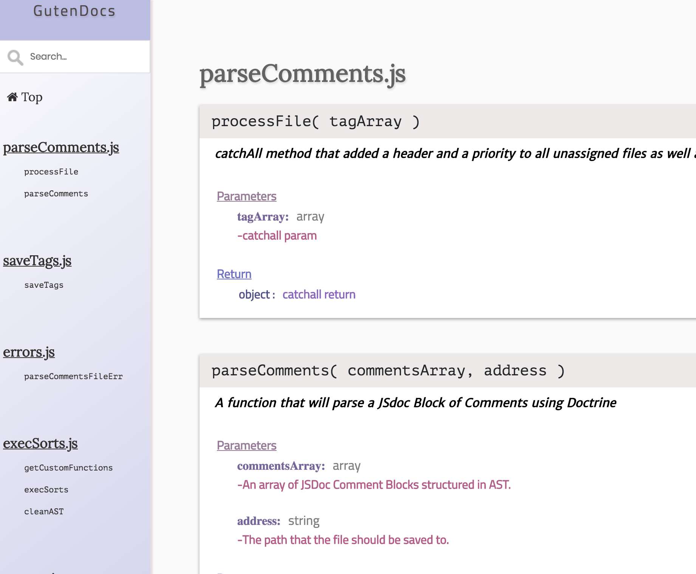

# GutenDocs

Named for [Johannes Gutenberg](https://en.wikipedia.org/wiki/Johannes_Gutenberg), the inventor of movable type, GutenDocs is CLI dev tool that auto-generates API Documentation from your javascript code base by parsing JSDoc comments from your .js and .jsx files.

## Team

- **Product Owner**: Uday Trivedi
- **Scrum Master**: Peter Gierke
- **Development Team Members**: Yuqi Zhu, David Park

This product is currently in development.  We would love any feedback from anyone making use of GutenDocs while it is under development.  Email us at gutentechdevs@gmail.com.

## Table of Contents

1. [Usage](#usage)
1. [Trouble Shooting](#trouble-shooting)
1. [Requirements](#requirements)
1. [Team](#team)
1. [Contributing](#contributing)

## Brief overview

JSDoc is a widely accepted markup language standard for annotating javascript code.  An example of what a JSDoc comment looks like is below:
```js
/**
 * Finds the next unused name in the directory to save a backup file
 * @param { string } location the path to the directory of intesting
 * @param { string } baseName the original name of the file being backed up
 * @example findValidBackupName('somePath', exam.js) returns exam.backup.js
 * @example findValidBackupName('somePath', exam.js) returns exam.backup0.js
 * @example findValidBackupName('somePath', exam.js) returns exam.backup1.js
 * @return { string } a string taking the form of a unused backup name
 */
const findValidBackupName = (location, baseName) => {...}
```
GutenDocs will parse each JSDoc comment in your code base like this:




All of the comments will be put together into an webpage that can be viewed like in the image below:



## Usage

### Getting ready to use GutenDocs

From anywhere call `npm install -g gutendocs`.  This will give you access to the `gutendocs` shell command.

### Initializing gutendocs

Now from any location, preferably the root of a repo, you can call `gutendocs init [foldername]` which will initialize an API folder directly in the directory you are currently working in.  It will also create a settings file called `.gutenrc.json` and a `.gutenignore` that will allow you to customize your usage of GutenDocs.  

#### .gutenrc explanation

`.gutenrc.json` is a file that contains all the settings you can customize for for your API Documentation.  An explanation of those settings is below:

<pre lang="javascript" width="46em">
"apiDir": // this is the folder your API Documentation will be created in. [default = GutenAPI]
"skeleton": { // this outlines the structure of how your API Documentation will be organized
    "sortByOrder": [ // the order the sort methods in this array will define in what order things are categorized
      "sortByFileName",
      "sortBySection",
      "sortByParentDirectoryName"
    ],
    "sortBySection": {  // sort by section allows you to define what tag you want to use as a grouping tool
      "section": "@section" // here we have specified that @section is the grouping tag. So anything with @section group1 would be organized into group1 on the APIn Documentation.  @section group2 would create another section
    },
    "sortByFileName": { // this sorting method would group things by the file they are written in
      "includeExtension": false  
    },
    "sortByParentDirectoryName": { // this sorting method will group things based on the folder the file is in
      "targetDepth": 1 // defined how many folders above you wish to go.
    },
    "catchAll": {  // this will always run at the end and group anything not caught in another sorter into the group defined by the "section" key value
      "section": "Miscellaneous"
    }
  },
  "customSorters": {  // here you can add as many sorters of your own design that you want 
    "sorterName": { // specify the name
      "sorterRelPath": "CustomSorters/sorterName.js", // specify the path to the sorter
      "sorterSpecs": { // you can set it up to have easily changed variable here
        "someSpecOne": "foo"
      }
    },
    "sorterNameTwo": { // second example, same as above
      "sorterRelPath": "CustomSorters/sorterNameTwo.js",
      "sorterSpecs": {
        "someSpecOne": "bar"
      }
    }
  },
  "doctrineSettings": { // it is suggested you leave all these on, if false then the parser will crash on corresponding issues
    "unwrap": true,
    "recoverable": true,
    "sloppy": true
  },
  "verbosity": 1 // this defines how much information you will see from errors.  The higher the number the more information
}
</pre>

#### designSettings.js explanation

designSettings.js is a file that allows you to manage the design of the API Documentation.  It will be generated with defaults in your API folder.

<pre lang="javascript" width="46em">
banner: {  // image logo to use
  src: './imgs/newLogo.png',  
  alt: 'Guten Docs',
  height: '185',
  width: '175',
},
projectName: 'GutenDocs', // name of project, displayed on tab, header and above sidebar
  colors: {  // color scheme to use
    primaryColorOne: false, // use string format eg: "#bada55"
    primaryColorTwo: false, // use string format eg: "#bada55"
    primaryColorThree: false, // use string format eg: "#bada55"
    primaryColorFour: false, // use string format eg: "#bada55"
    primaryColorFive: false, // use string format eg: "#bada55"
  },
anchorHashJump: 10,  // how far above the linked hashtag to jump to
introTxt: { // for every key in this object one section will be rendered with the title of the key and the content of the value of that key
  heading(1): 'paragraph(1) Lorem ipsum dolor sit amet, consectetur adipiscing elit',
  ...
  heading(n): 'paragraph(n) Lorem ipsum dolor sit amet, consectetur adipiscing elit',
},
</pre>
#### Using themes
At GutenTech we know style is important.  We have set up some default themes that you can quickly use to adjust the way your API is rendered.  You can see a list of the themes and their descriptions with `gutendocs theme --list` or `gutendocs theme -l`.  You can then set the theme of your choice by calling `gutendocs theme [themeName]`. You can add custom themes in the API Documentation theme folder following the existing structure to add your own.

#### Using your .gutenignore

Your `.gutenignore` works just like a `.gitignore` file and will ignore folders and files you specify and allow for the use of * as a wild card.  You can also place nested `.gutenignore` files inside of subfolders and it will add ignore criteria in that folder and its subfolder as indicated in that directories `.gutenignore`.  `.gutenignore` is generated for you with the `node_modules` folder, any files or folders starting with a `.` and the generated API Documentation folder will be ignored from the start.  You most likely will want to add other folders to this such as test folders, mock folders or anything else that you might not want or need included in the API Documentation.

### Adding your JSDoc string documented information to the API Documentation.

Now that you have configured gutendocs settings and your styles the way you want it, is time to extract all those well written comments from your code and organize them into a beautiful document. Go to whatever folder or file you want to generate an API Documentation for and run either `gutendocs parse [filename]` to parse a single file or `gutendocs parse --all` to parse the current directory and any subdirectories

Depending on your verbosity level (which can be set with `gutendocs verbosity/verbose [0-5]`) you will then see an output with information about the parsing process.  If you want to know more, like which files have not been parsed, or why they were not parsed, then turn up the verbosity.

### Viewing your API Documentation

Now that you have set all your settings like you wanted, and parsed the files you wanted, lets open up your API Documentation.

Now you can open the index.html file inside your API Documentation folder in your web browser of choice, et voila.  Your API Documentation has been created for you.  Congratulations!

### Trouble Shooting/FAQ

**Help! I've forgotten how to use gutendocs!** <br />
```No worries, just run `gutendocs help` or `gutendocs <command> --help` for more information.```

**Help! I've made a mess of my API Documentation folder. And I am missing files or don't know what it should look like.** <br />
```No worries,  If you want to start from scratch you can call `gutendocs reset` to overwrite your whole folder to be the way it was when you initialized.  If you want to retain a copy of the way it was before you can run `gutendocs reset --backup` and it will back up a copy of your current version of the folder as [foldername].backup.```

**Help! I've made a mess of my .gutenrc.json and it's missing things I need or is now invalid.**<br />
```No worries,  If your gutenrc.json is an invalid JSON object and you try to run any gutendoc's commands it will ask you if you would like to restore the .gutenrc.json to its original state.  If you choose to do that it will also ask if you want to save a backup file.  The backup will be saved in the same location as the .gutenrc.json as .gutenrc.backup.json so you can use it as a reference while you are rebuilding on the newly created gutenrc.json.```

**Help! I just want to start over from scratch.**<br />
```No worries.  Just delete your .gutenrc, .gutenignore and the API Documentation folder and rerun `gutendocs init`.```

**Help! I deleted a ton of settings in gutenrc.json.**<br />
```No worries.  For any setting not present in gutenrc.json the defaults will be loaded.```

**Help! I've found a problem that I don't know what to do with that isn't covered above!**<br />
```Sorry to hear that.  Please send an email to gutentechdevs@gmail.com and we will look into this issue for you.```

## Requirements

- Node 8.11.3+

## Contributing

See [CONTRIBUTING.md](CONTRIBUTING.md) for contribution guidelines.
